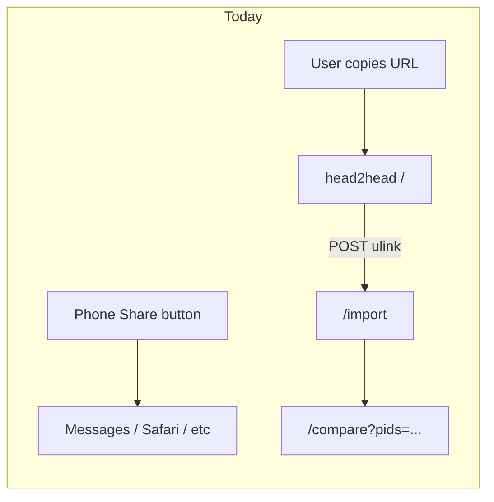
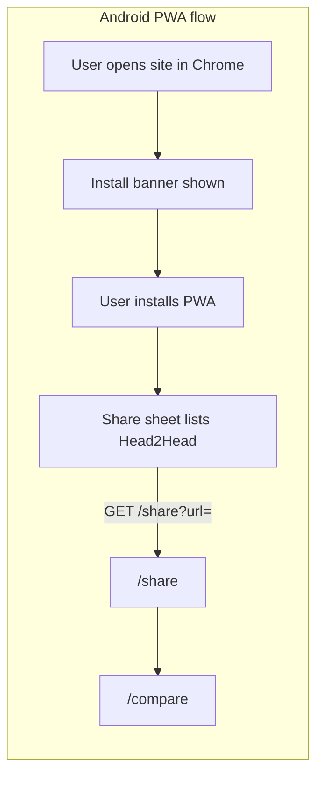

# Android Share Target (PWA) — Implementation Plan

> **Status:** Planned — not yet implemented.  
> **Scope:** Android only for v1. iOS share targets deferred (see [Future: iOS](#future-ios-out-of-scope-for-v1)).

## Goal

Let Android users share an RTRT or Sportstats link directly to Head2Head from the system share sheet — no copy-paste. No Play Store app required.

After a one-time install from Chrome, Head2Head appears alongside Messages, Gmail, etc. when sharing a URL.

---

## Glossary: What is a PWA?

**PWA** = **Progressive Web App**. It is not a different product — it is this same Flask website plus a few browser-facing files:

| Piece | Purpose |
|-------|---------|
| **Web app manifest** | App name, icons, theme color, `share_target` registration |
| **Service worker** | Required for installability; can be minimal (mostly passthrough) |
| **HTTPS** | Already satisfied on Fly.io |

When installed, the site gets a home-screen icon and opens in its own window. On Android Chrome, an installed PWA can register as a **share target** via the Web Share Target API.

**What a PWA is not:** a native rewrite, an App Store listing, or a separate codebase. The compare UI stays exactly as it is today.

---

## How Head2Head works today

Head2Head is a responsive Flask web app ([`app.py`](../../app.py)) on Fly.io. Share links enter only via **POST** to `/import` with form field `ulink`:

```python
@app.route("/import", methods=["POST"])
def import_ulink():
    ulink = (request.form.get("ulink") or "").strip()
    ...
```

There is no web manifest, service worker, or share route. All share-target work builds on this entry point.



---

## Target flow (Android v1)



**Caveats (document these for users, keep them short):**

- Install is one-time; share target only appears **after** install.
- Chrome or Edge on Android only (not Firefox Android).
- No Play Store required.

---

## Implementation checklist

### 1. Backend: `GET /share` route

Share APIs deliver URLs via GET query params, not HTML form POST.

Add `GET /share` in [`app.py`](../../app.py) and refactor `import_ulink()` to call a shared helper:

```python
def _import_and_redirect(ulink: str):
    """Shared logic for POST /import and GET /share."""
    ...

@app.route("/share")
def share_import():
    ulink = (request.args.get("url") or request.args.get("text") or "").strip()
    # Extract first https:// URL from text if needed
    return _import_and_redirect(ulink)

@app.route("/import", methods=["POST"])
def import_ulink():
    ulink = (request.form.get("ulink") or "").strip()
    ...
```

**URL extraction:** shares sometimes send `text` instead of `url` (e.g. `"Check out https://rtrt.me/..."`). Pull the first `http(s)://` URL from `text` when `url` is empty.

**Security:** validate that extracted URLs match known providers (RTRT, Sportstats) before calling `resolve_share_url()` — same validation the paste form effectively requires.

**Tests:** extend [`tests/test_routes.py`](../../tests/test_routes.py) with GET `/share?url=...` cases mirroring existing POST `/import` tests.

---

### 2. PWA assets

| File | Purpose |
|------|---------|
| [`static/manifest.webmanifest`](../../static/manifest.webmanifest) | App identity + `share_target` |
| [`static/sw.js`](../../static/sw.js) | Minimal service worker (install gate) |
| [`static/icons/icon-192.png`](../../static/icons/icon-192.png) | Home-screen icon (`purpose: any`) |
| [`static/icons/icon-512.png`](../../static/icons/icon-512.png) | Splash / install UI (`purpose: any`) |
| [`static/icons/icon-512-maskable.png`](../../static/icons/icon-512-maskable.png) | Android adaptive icon (`purpose: maskable`) |
| [`static/icons/icon-source-1024.png`](../../static/icons/icon-source-1024.png) | Master source (RGBA, re-export if needed) |

**Icons are prepared.** Wire the three manifest entries (192, 512 any, 512 maskable) when implementing the PWA.

Example manifest `share_target` block:

```json
{
  "name": "Head2Head",
  "short_name": "Head2Head",
  "start_url": "/",
  "display": "standalone",
  "share_target": {
    "action": "/share",
    "method": "GET",
    "enctype": "application/x-www-form-urlencoded",
    "params": {
      "url": "url",
      "text": "text",
      "title": "title"
    }
  }
}
```

Wire manifest in [`templates/index.html`](../../templates/index.html) (and [`templates/compare.html`](../../templates/compare.html) if install prompt should appear there too):

```html
<link rel="manifest" href="/static/manifest.webmanifest">
<meta name="theme-color" content="...">
```

Serve manifest with correct `Content-Type: application/manifest+json` (Flask static may be fine; verify in Chrome DevTools → Application → Manifest).

Register service worker from templates:

```javascript
if ('serviceWorker' in navigator) {
  navigator.serviceWorker.register('/static/sw.js');
}
```

---

### 3. In-app install UX (Android)

**Principle:** users should not have to hunt through Chrome menus. The site should guide them.

**Detection logic** (small module, e.g. [`static/install-prompt.js`](../../static/install-prompt.js)):

1. Already installed → hide banner (`window.matchMedia('(display-mode: standalone)').matches` or `navigator.standalone` on iOS — irrelevant for v1 but harmless).
2. Android + Chrome → listen for `beforeinstallprompt`, stash the event, show a dismissible banner.
3. Banner tap → call `prompt()` on the stashed event.
4. After successful install → swap banner for a short "You're set — share a race link and pick Head2Head" message.

**Banner copy (keep minimal):**

- Before install: **"Install Head2Head to compare splits from the share menu."** + Install button + Dismiss.
- After install: **"Installed. Share a race link from RTRT or Sportstats and choose Head2Head."**

**Where to show:** home page at minimum; consider compare page too (returning users may land there directly).

**Do not show** on desktop browsers or when already running as installed PWA.

**Fallback:** if `beforeinstallprompt` never fires (older Chrome, already dismissed at OS level), banner text should say: *Chrome menu (⋮) → Install app*.

---

### 4. README: user-facing instructions

Add a short section to [`README.md`](../../README.md) — this is what users (and future-you) will reference. Keep it to three steps:

```markdown
## Share from other apps (Android)

1. Open Head2Head in **Chrome**.
2. Tap **Install** when the banner appears (or Chrome menu → **Install app**).
3. In RTRT or Sportstats, tap **Share** on a race link and choose **Head2Head**.

Works after the one-time install. No Play Store needed.
```

No developer jargon (manifest, service worker, PWA) in the README — save that for this plan doc.

Optionally add the same blurb as a collapsible "How to install" link on the home page for users who dismissed the banner.

---

## What you explicitly do NOT need (v1)

- Play Store listing
- Native Android app / Kotlin code
- iOS Shortcut, Share Extension, or App Store app
- Universal Links / App Links (those handle opening *your* links, not receiving shares)
- Changes to the `racedata` package — share target is URL routing into existing `resolve_share_url()`

---

## Risks / gotchas

| Risk | Mitigation |
|------|------------|
| Open redirect on `/share` | Only accept known provider URL patterns |
| Share sends plain text, not URL | Extract first `https://` from `text` param |
| User installs but doesn't know next step | Post-install confirmation message on site |
| `beforeinstallprompt` not available | Fallback copy pointing to Chrome menu |
| Session cookies in standalone mode | Same-origin Fly.io hosting — should work; verify after install |

---

## Future: iOS (out of scope for v1)

Safari does **not** support the Web Share Target API. iOS users keep the paste flow for now.

If iOS share targets become worth pursuing later, options are:

| Approach | Share sheet shows "Head2Head"? | App Store? |
|----------|-------------------------------|------------|
| Keep paste flow | No | No |
| Apple Shortcut | No — appears under "Shortcuts" | No |
| Thin native app + Share Extension | Yes | Yes |

The `GET /share` route built for Android also serves iOS Shortcut or native extension paths — no backend rework needed. See WebKit/share-extension docs when revisiting.

---

## Implementation todos

When ready to implement, hand this doc to the agent (or work through in order):

- [ ] **share-get-endpoint** — Add `GET /share`; extract `_import_and_redirect()` shared helper; URL extraction from `text`
- [ ] **android-pwa** — manifest, icons, minimal service worker, template wiring
- [ ] **android-install-prompt** — `install-prompt.js` + banner UI; detect Android/standalone; handle `beforeinstallprompt`
- [ ] **readme-docs** — Three-step Android section in README; optional on-site help link
- [ ] **tests** — GET `/share` route tests in `tests/test_routes.py`

**Deferred:**

- [ ] **ios-shortcut** — Apple Shortcut + docs (only if iOS friction becomes a problem)
